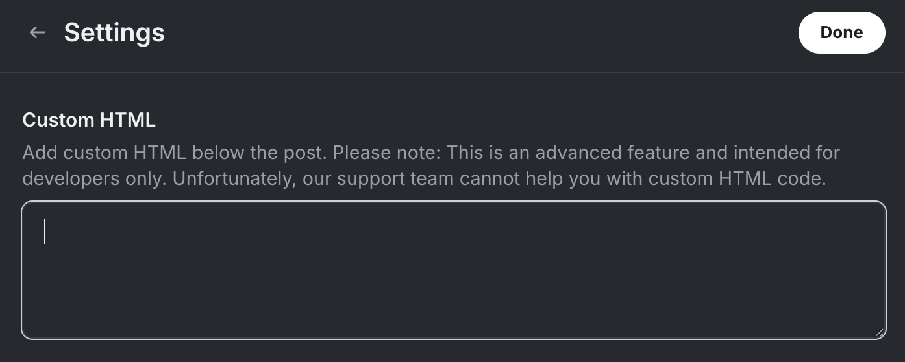
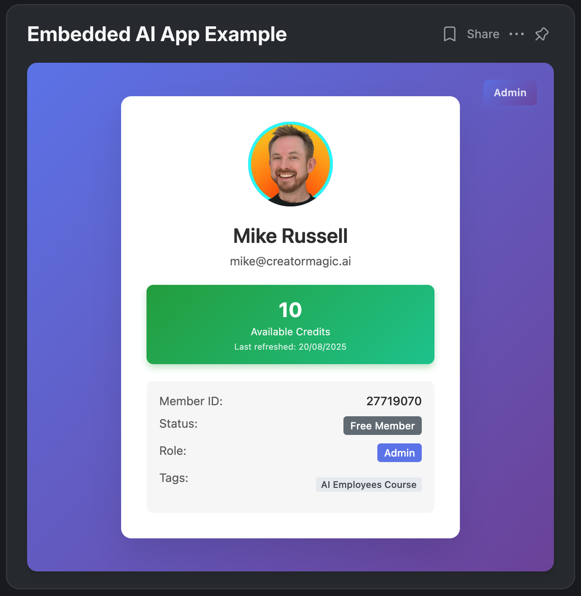

# Circle Member App - Enterprise Authentication & Credit System

## 🎯 What This Is For

**Build custom AI powered apps for your Circle community members with fine grained access control.**

This is the perfect foundation for creating member exclusive tools, AI applications, or premium features that only your authenticated, paid, or specifically tagged members can access. Whether you want to build:

- 🤖 **AI Content Generators** (GPT powered tools, image generators, etc.)
- 🛠️ **Premium Member Tools** (calculators, analyzers, custom utilities)
- 📊 **Member Only Dashboards** (analytics, reports, exclusive content)
- 💡 **Interactive Features** (quizzes, assessments, personalized experiences)

This app provides the authentication backbone, credit system, and member management you need.

## 🚀 How It Works

### Simple 3 Step Setup:

1. **Deploy this app** to your server with your Circle API credentials
2. **Create a new post** in your Circle community  
3. **Add the embed code** to the post's Custom HTML field (see screenshot below)



Your members can then access your custom app directly within Circle, with automatic authentication and credit management.

### Example: What Your Embedded App Looks Like

Here's an example of how the embedded AI app appears to your Circle members:



The app automatically:
- ✅ **Authenticates the member**
- 💳 **Shows their credit balance**
- 👤 **Displays member info**
- 🔄 **Tracks credit refresh dates**
- 🎯 **Provides admin access**

---

## 🔧 Technical Overview

A secure, enterprise grade embedded authentication application for [Circle.so communities](https://mrc.fm/circle) that provides automatic member authentication using Circle's Headless API with built-in credit management and comprehensive database integration.

## 🚨 Requirements

> **Important**: This application requires a **[Circle Business Plan](https://mrc.fm/circle) or above** to access both the Headless Auth API and Admin API functionality. These APIs are not available on Starter or Basic plans.

## ✨ Key Features

### Authentication & Security
- 🔐 **Automatic Member Authentication**: Seamlessly authenticates Circle members using multiple detection methods
- 🛡️ **Enterprise Security**: Multi layered security architecture preventing unauthorized access
- 🔒 **Headless API Integration**: Full integration with Circle's enterprise Headless Auth API
- 🏷️ **Admin API Integration**: Automatic management of member tags and purchase processing
- 🚫 **Iframe Enforcement**: Configurable requirement for embedding within Circle communities only
- ✅ **CORS & Origin Validation**: Comprehensive request validation and origin checking
- 🔑 **Multiple Auth Fallbacks**: 10+ methods to extract and verify member data

### Member Management
- 📊 **PostgreSQL Database**: Full member data synchronization and persistent storage
- 💳 **Advanced Credit System**: Automated credit allocation, monthly refreshes, and usage tracking
- 💰 **Purchase Tag Processing**: Automatic detection and processing of numeric purchase tags ($10, $50, etc.)
- 👥 **Paid Member Detection**: Automatic identification of premium members via configurable tags
- 📈 **Action Logging**: Complete audit trail of all member actions and credit transactions
- 🎨 **Admin Panel**: Built in administrative interface for member and credit management

### Technical Features
- 📱 **Responsive Design**: Optimized for all devices and screen sizes (desktop and mobile web browsers - note: custom HTML embeds have limitations in Circle's mobile app)
- 🔄 **Real-time Sync**: Automatic database synchronization on authentication
- 🎯 **PostMessage Communication**: Secure cross-origin data exchange
- 🐳 **Docker Support**: Production ready containerization with Docker Compose
- 📝 **Comprehensive Logging**: Detailed debugging and monitoring capabilities

## 🏗️ Architecture

```
┌────────────────────────────────────────────────────────┐
│                    Circle Community                    │
│  ┌─────────────────────────────────────────────────┐   │
│  │            Circle Member (Browser)              │   │
│  │                                                 │   │
│  │  ┌──────────────┐        ┌──────────────┐       │   │
│  │  │ window.      │───────▶│   Iframe     │       │   │
│  │  │ circleUser   │        │  (Your App)  │       │   │
│  │  └──────────────┘        └──────────────┘       │   │
│  └─────────────────────────────────────────────────┘   │
└────────────────────────────────────────────────────────┘
                              │
                              ▼ PostMessage
                    ┌───────────────────┐
                    │   Express Server  │
                    │   (server.js)     │
                    └───────────────────┘
                              │
                    ┌─────────┴──────────┐
                    ▼                    ▼
          ┌──────────────────┐  ┌───────────────────┐
          │ Circle Headless  │  │   PostgreSQL DB   │
          │     Auth API     │  │  - members        │
          └──────────────────┘  │  - credits        │
                                │  - actions        │
                                │  - history        │
                                └───────────────────┘
```

## 📋 Prerequisites

- **[Circle Business Plan or higher](https://mrc.fm/circle)** (required for API access)
- Node.js 14+ and npm
- Docker and Docker Compose (recommended for production)
- PostgreSQL 15+ (included in Docker setup)
- A Circle community with custom HTML support enabled

## 🚀 Quick Start

### 1. Clone the Repository

```bash
git clone https://github.com/Creator-Magic/circle-member-app.git
cd circle-member-app
```

### 2. Install Dependencies

```bash
npm install
```

### 3. Configure Environment

Copy `.env.example` to `.env` and configure with your values:

```bash
cp .env.example .env
```

```env
# ============================================
# CIRCLE API CONFIGURATION
# ============================================
# CRITICAL: Must be "Headless Auth" token from Circle Developers
# Get from: Circle Admin → Developers → Tokens → Create Token (type: Headless Auth)
# Requires Circle Business Plan or higher
CIRCLE_API_TOKEN=your_headless_auth_token_here

# CRITICAL: Circle Admin API token for managing tags
# Get from: Circle Admin → Developers → Tokens → Create Token (type: Admin API)
# Required for automatic purchase tag removal
# Requires Circle Business Plan or higher
CIRCLE_ADMIN_API_TOKEN=your_admin_api_token_here

# Your Circle community domain (without protocol)
CIRCLE_COMMUNITY_DOMAIN=your-community.circle.so

# ============================================
# APPLICATION CONFIGURATION
# ============================================
# Your application's public domain
APP_DOMAIN=your-app.example.com

# Allowed origins for CORS (comma-separated)
ALLOWED_ORIGINS=https://your-community.circle.so,https://your-app.example.com

# Application port
PORT=8080

# ============================================
# MEMBER CONFIGURATION
# ============================================
# Tags that identify paid/premium members (comma-separated)
PAID_MEMBER_TAGS=paid,premium,subscriber,member,vip,pro,business

# ============================================
# DATABASE CONFIGURATION
# ============================================
POSTGRES_DB=circle_app
POSTGRES_USER=circle_user
POSTGRES_PASSWORD=your_super_secure_password_here
DATABASE_URL=postgres://circle_user:your_super_secure_password_here@db:5432/circle_app

# ============================================
# CREDIT SYSTEM CONFIGURATION
# ============================================
# Initial credits granted to new members
INITIAL_CREDITS_FREE=10
INITIAL_CREDITS_PAID=100

# Monthly credit refresh amounts
MONTHLY_CREDITS_FREE=10
MONTHLY_CREDITS_PAID=100

# ============================================
# SECURITY CONFIGURATION
# ============================================
# Production security settings (set to true for production)
REQUIRE_IFRAME=true              # Enforce iframe embedding
DISABLE_EMAIL_ONLY_AUTH=true    # Disable insecure email-only auth

# Environment mode
NODE_ENV=production
```

### 4. Start with Docker Compose

```bash
# Start all services (app + database)
docker compose up -d

# Initialize database schema
docker cp database/schema.sql $(docker compose ps -q db):/schema.sql
docker compose exec db psql -U circle_user -d circle_app -f /schema.sql

# View logs
docker compose logs -f
```

## 🔑 Getting Your Circle API Tokens

### Headless Auth Token (Required)
1. Log in to your [Circle community](https://mrc.fm/circle) admin panel
2. Navigate to **Developers** → **Tokens**
3. Click **Create Token**
4. **⚠️ IMPORTANT**: Select type **"Headless Auth"** (NOT "API Token")
5. Name your token (e.g., "Member App Authentication")
6. Copy the generated token to `CIRCLE_API_TOKEN` in your `.env` file

### Admin API Token (Required for Purchase Tags)
1. In the same **Developers** → **Tokens** section
2. Click **Create Token** again
3. Select type **"Admin API"**
4. Name your token (e.g., "Tag Management")
5. Copy the generated token to `CIRCLE_ADMIN_API_TOKEN` in your `.env` file

> **Note**: Both tokens require Circle Business Plan or higher. Regular API tokens will NOT work.

## 🎯 Embedding in Your Circle Community

### Step 1: Configure the Embed Template

Update `circle-embed.html` with your app domain:

```javascript
const ALLOWED_APP_ORIGIN = 'https://your-app-domain.com';
```

### Step 2: Create a Post in Circle

1. **Navigate to your Circle community**
2. **Create a new post** (or edit an existing one)
3. **Click the settings cog** in the post editor
4. **Scroll down to "Custom HTML"** field (see screenshot above)
5. **Copy and paste** the complete contents of your configured `circle-embed.html` file

The Custom HTML field allows you to embed your app directly into Circle posts, making it accessible to your community members with seamless authentication.

### What the Embed Code Contains

The `circle-embed.html` file includes:

```html
<!-- Your app iframe -->
<iframe 
    id="circle-member-app"
    src="https://your-app-domain.com"
    width="100%" 
    height="600" 
    frameborder="0"
    style="border-radius: 12px; box-shadow: 0 4px 6px rgba(0, 0, 0, 0.1);">
</iframe>

<script>
    // Complete authentication script that:
    // - Extracts Circle member data from window.circleUser
    // - Handles multiple authentication fallback methods
    // - Communicates securely with your app via PostMessage
    // - Provides real-time member authentication
</script>
```

### Step 3: Publish and Test

1. **Save/publish your post**
2. **View the post** as a member to test authentication
3. **Check browser console** for authentication logs
4. **Verify member data** is correctly passed to your app

## 💾 Database Schema

The application uses PostgreSQL with the following core tables:

### Members Table
- `circle_member_id`: Unique Circle member identifier
- `email`: Member's email address
- `name`: Member's display name
- `avatar_url`: Profile picture URL
- `is_paid`: Boolean indicating premium status
- `tags`: JSON array of member tags
- `first_seen_at`: First authentication timestamp
- `last_seen_at`: Most recent activity

### Credit System Tables
- **`member_credits`**: Current credit balances and refresh tracking
- **`app_actions`**: Log of all credit-consuming actions
- **`credit_history`**: Complete audit trail of credit changes

### Automatic Features
- Timestamp tracking on all records
- Foreign key constraints for data integrity
- Optimized indexes for query performance
- JSONB support for flexible metadata storage
- Automatic credit history logging via triggers

## 🔌 API Endpoints

### Authentication Endpoints

| Method | Endpoint | Description |
|--------|----------|-------------|
| GET | `/api/config` | Returns client configuration |
| POST | `/api/auth` | Authenticates member and syncs to database |
| POST | `/api/auth/cookies` | Cookie-based authentication fallback |
| GET | `/api/member/check` | Validates current session |

### Credit System Endpoints

| Method | Endpoint | Description |
|--------|----------|-------------|
| GET | `/api/credits/:circle_member_id` | Get current credit balance |
| POST | `/api/credits/spend` | Consume credits for an action |
| GET | `/api/credits/:circle_member_id/history` | Transaction history |
| GET | `/api/actions/:circle_member_id` | Member's action log |

### Admin Endpoints

| Method | Endpoint | Description |
|--------|----------|-------------|
| GET | `/admin` | Admin panel interface |
| GET | `/api/admin/members` | List all members |
| POST | `/api/admin/credits/grant` | Manually grant credits |
| GET | `/api/admin/stats` | System statistics |

## 💳 Credit System

### How It Works

1. **Initial Allocation**: New members receive credits based on membership type
   - Free members: Configurable via `INITIAL_CREDITS_FREE`
   - Paid members: Configurable via `INITIAL_CREDITS_PAID`

2. **Monthly Refresh**: Automatic credit replenishment after 30 days
   - Credits are added to existing balance (not replaced)
   - Configurable amounts for free and paid tiers

3. **Purchase Tags**: Automatic processing of numeric tags
   - Detects tags like "$10", "$50", "$100" or "10", "50", "100"
   - Credits are immediately added to member balance
   - Tags are automatically removed via Admin API
   - Perfect for one-time credit purchases

4. **Usage Tracking**: All credit consumption is logged with:
   - Action type and cost
   - Timestamp and metadata
   - Complete audit trail

### Example Implementation

```javascript
// Spending credits for a feature
const response = await fetch('/api/credits/spend', {
  method: 'POST',
  headers: { 'Content-Type': 'application/json' },
  body: JSON.stringify({
    circle_member_id: member.id,
    action_type: 'generate_content',
    credits_cost: 10,
    metadata: {
      feature: 'ai_generation',
      prompt: 'User prompt here',
      model: 'gpt-4'
    }
  })
});

if (response.status === 402) {
  alert('Insufficient credits! Please wait for monthly refresh.');
} else if (response.ok) {
  const result = await response.json();
  console.log(`Credits remaining: ${result.credits_remaining}`);
}
```

## 🛡️ Security Features

### Multi Layer Security Architecture

1. **Environment Based Configuration**
   - All sensitive data stored in `.env` files
   - Never commit secrets to version control

2. **CORS Protection**
   - Strict origin validation
   - Configurable allowed domains
   - Credential support for secure cookies

3. **Iframe Enforcement**
   - Optional requirement for embedding
   - Prevents direct access to application
   - Validates parent window origin

4. **Authentication Security**
   - Headless API token validation
   - Referrer header verification
   - PostMessage origin checking
   - Session token management

5. **Database Security**
   - Prepared statements prevent SQL injection
   - Connection pooling for performance
   - Transaction support for data integrity
   - Automatic rollback on errors

## 🐳 Docker Deployment

### Production Deployment with Docker Compose

```yaml
services:
  app:
    build: .
    ports:
      - "8080:8080"
    env_file: .env
    depends_on:
      - db
    restart: always

  db:
    image: postgres:15-alpine
    environment:
      POSTGRES_DB: ${POSTGRES_DB}
      POSTGRES_USER: ${POSTGRES_USER}
      POSTGRES_PASSWORD: ${POSTGRES_PASSWORD}
    volumes:
      - postgres_data:/var/lib/postgresql/data
      - ./database/schema.sql:/docker-entrypoint-initdb.d/schema.sql
    restart: always

volumes:
  postgres_data:
```

### Commands

```bash
# Production deployment
NODE_ENV=production docker compose up -d

# View logs
docker compose logs -f app

# Database backup
docker compose exec db pg_dump -U circle_user circle_app > backup.sql

# Database restore
docker compose exec db psql -U circle_user circle_app < backup.sql

# Stop services
docker compose down
```

## 🔧 Troubleshooting

### Common Issues and Solutions

#### "Must be on Circle Business Plan or above"
- **Solution**: Upgrade to [Circle Business Plan](https://mrc.fm/circle) for API access

#### "Invalid or missing API token"
- **Cause**: Using wrong token type
- **Solution**: Ensure you're using a "Headless Auth" token, not a regular API token

#### "Not allowed by CORS"
- **Cause**: Domain not in allowed origins
- **Solution**: Add your domain to `ALLOWED_ORIGINS` in `.env`

#### "This app can only be accessed from within Circle"
- **Cause**: Direct access when iframe is required
- **Solution**: Access through Circle community or set `REQUIRE_IFRAME=false` for development

#### "Database connection error"
- **Cause**: PostgreSQL not running or misconfigured
- **Solution**: Check `DATABASE_URL` and ensure PostgreSQL is running

#### "Member not found"
- **Cause**: Member doesn't exist or API issue
- **Solution**: Verify member exists in Circle and token has proper permissions

#### Credits not refreshing
- **Cause**: Less than 30 days since last refresh
- **Solution**: Wait for monthly refresh period or manually grant credits via admin panel

## 📊 Monitoring & Debugging

### Enable Debug Logging

Set in `.env`:
```env
DEBUG=true
LOG_LEVEL=verbose
```

### Check Browser Console

Look for:
- `=== CIRCLE MEMBER DATA EXTRACTION ===`
- `=== POSTMESSAGE RECEIVED ===`
- `✅ Authentication successful!`
- Credit balance updates

### Server Logs

Monitor with:
```bash
docker compose logs -f app | grep -E "(AUTH|CREDIT|ERROR)"
```

## 🚦 Development vs Production

### Development Settings
```env
NODE_ENV=development
REQUIRE_IFRAME=false
DISABLE_EMAIL_ONLY_AUTH=false
DEBUG=true
```

### Production Settings
```env
NODE_ENV=production
REQUIRE_IFRAME=true
DISABLE_EMAIL_ONLY_AUTH=true
DEBUG=false
```

## 📝 Best Practices

1. **Always use HTTPS** in production environments
2. **Rotate API tokens** regularly for security
3. **Monitor credit usage** for unusual patterns
4. **Backup database** regularly
5. **Review logs** for failed authentication attempts
6. **Update dependencies** to patch security vulnerabilities
7. **Use strong passwords** for database access
8. **Implement rate limiting** for API endpoints
9. **Set up monitoring** for system health
10. **Document custom modifications** for maintenance

## 🤝 Contributing

Contributions are welcome! Please:
1. Fork the repository
2. Create a feature branch
3. Add tests for new functionality
4. Ensure all tests pass
5. Submit a pull request

## 📄 License

MIT License - See LICENSE file for details

## 🆘 Support

- **Circle Platform**: [Circle.so](https://mrc.fm/circle)
- **Documentation**: Check `/AGENTS.md` for detailed technical documentation
- **Issues**: Open an issue on GitHub
- **Community**: Join the Circle community for discussions

## 🙏 Acknowledgments

Built for the [Circle.so](https://mrc.fm/circle) community platform to enhance member experiences with secure authentication and credit management.

## 🚀 Creator Magic Premium - Vibe Coding Lab

This project was created as part of **[Creator Magic Premium](https://mrc.fm/premium)** members working together to make cool things with AI in our **Vibe Coding Lab**.

### What is the Vibe Coding Lab?

The Vibe Coding Lab is a community led initiative where premium members collaborate on open source projects, share knowledge, and build innovative tools together. It's a space for creators to:

- 🤝 **Collaborate** on real-world projects
- 🧠 **Share knowledge** and learn from each other  
- 🛠️ **Build tools** that solve actual problems
- 🌟 **Experiment** with AI and emerging technologies

### Join the Community

Want to be part of building the next generation of creator tools? Join us at **[Creator Magic Premium](https://mrc.fm/premium)** and participate in our collaborative coding sessions!

---

**Remember**: This application requires a [Circle Business Plan or above](https://mrc.fm/circle) for API access. Both the Headless Auth API and Admin API are not available on Starter or Basic plans.

## 💰 Purchase Tag Processing

### How It Works

The app automatically detects and processes numeric tags for one time credit purchases:

1. **Tag Detection**: When a member authenticates, the app checks for numeric tags:
   - Format: "$10", "$50", "$100" (with dollar sign)
   - Format: "10", "50", "100" (without dollar sign)

2. **Credit Addition**: The numeric value is added to the member's credit balance

3. **Tag Removal**: The tag is automatically removed from Circle using the Admin API

4. **Audit Logging**: All transactions are logged in the database

### Setup Requirements

1. **Configure Admin API Token** in `.env`:
   ```env
   CIRCLE_ADMIN_API_TOKEN=your_admin_api_token_here
   ```

2. **Create Purchase Tags** in Circle:
   - Go to Circle Admin → Members → Tags
   - Create tags like "$10", "$50", "$100"
   - Apply these tags when members make purchases

3. **Integration with Payment Systems**:
   - Use Circle's Zapier integration to apply tags after payment
   - Or manually apply tags after processing payments
   - Tags are processed immediately on next member authentication

### Example Flow

1. Member purchases 50 credits through your payment system
2. Your system (or manually) applies the "$50" tag in Circle
3. Member logs into the app
4. App detects the "$50" tag
5. 50 credits are added to member's balance
6. The "$50" tag is automatically removed from Circle
7. Transaction is logged for audit purposes

This system allows for flexible, one time credit purchases without requiring a separate payment integration in the app itself.